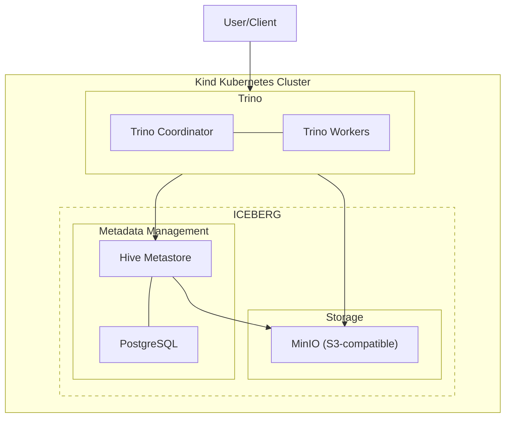

# Trino kubernetes demo for reading and writing Iceberg tables

This project provides a self-contained demo environment for working with Trino and Iceberg tables in Kubernetes. It sets up a complete data stack including Trino, Hive Metastore, PostgreSQL, and MinIO in a local Kind cluster, allowing you to explore Iceberg tables without cloud resources.

Whether you're new to Trino and Iceberg or want to test configurations locally before deploying to production, this demo offers a practical starting point.

## Table of Contents
- [Project Goals](#project-goals)
- [Prerequisites](#prerequisites)
- [Architecture](#architecture)
- [Getting Started](#getting-started)
- [Usage Example](#usage-example)
- [Next Steps](#next-steps)
- [Support](#support)
- [License](#license)

## Project Goals

- Demonstrate Trino integration with Iceberg tables in Kubernetes
- Provide a local development environment for data engineering experiments
- Serve as a reference implementation for a modern data stack
- Enable hands-on learning with minimal setup requirements

## Prerequisites

Before you begin, ensure you have the following tools installed:

| Tool | Version | Purpose |
|------|---------|---------|
| Docker | 20.10+ | Container runtime |
| kubectl | 1.22+ | Kubernetes CLI |
| kind | 0.14+ | Local Kubernetes cluster |
| helm | 3.8+ | Kubernetes package manager |
| make | 3.8+ | Task automation |

Optional but recommended:
- [k9s](https://k9scli.io/) - Terminal-based UI for monitoring Kubernetes
- [DBeaver](https://dbeaver.io/) or similar SQL client for connecting to Trino

## Architecture

The diagram below illustrates the architecture of this demo environment:



Key interactions:
- Trino queries data through the Hive Metastore, which tracks table schemas and metadata
- The actual data is stored in MinIO (S3-compatible storage)
- PostgreSQL stores the Hive Metastore database
- Client applications connect to the Trino coordinator to run queries

### Components

#### Trino
An open-source distributed SQL query engine designed for fast analytic queries on data of any size.
- Coordinator: Manages query planning and coordination
- Workers: Execute the distributed query tasks
- [Trino Helm charts](https://github.com/trinodb/charts)

#### MinIO
An S3-compatible object storage server that stores the actual data files.
- Provides the storage layer for Iceberg tables
- Configured with a single bucket called 'datalake'
- Accessible via the MinIO console at http://localhost:9001 when port-forwarded

#### Hive Metastore
The metadata repository for Iceberg tables.
- Tracks table schemas, partitioning, and file locations
- Enables Trino to discover and query Iceberg tables

#### PostgreSQL
A relational database that stores the Hive Metastore data.
- Supports the transactional requirements of the Hive Metastore
- Enables persistence of table metadata

#### Kind
A tool for running local Kubernetes clusters using Docker containers.
- Provides the Kubernetes environment without cloud resources
- Configured with a single-node cluster for this demo

## Getting Started

### Setting Up the Environment

1. Clone this repository:
   ```bash
   git clone https://github.com/yourusername/trino-iceberg-k8s-demo.git
   cd trino-iceberg-k8s-demo
   ```

2. Deploy the entire stack with a single command:
   ```bash
   make all
   ```
   This will:
   - Create a Kind Kubernetes cluster
   - Deploy MinIO for object storage
   - Set up PostgreSQL and Hive Metastore
   - Deploy Trino with appropriate configurations

3. Access the Trino UI:
   ```bash
   make trino-pf
   ```
   Then visit http://localhost:8080 in your browser
   - Default username: admin
   - No password required

### Connecting with SQL Clients

Connect to Trino using any JDBC-compatible SQL client like DBeaver:
- Host: localhost
- Port: 8080
- Username: admin
- No password
- JDBC URL: `jdbc:trino://localhost:8080`

### Accessing MinIO Console

To access the MinIO console:
```bash
make minio-pf
```

## Usage example

Create, query, delete Iceberg table:

```trino
show catalogs;
--  Catalog 
-- ---------
--  iceberg 
--  system  
--  tpcds   
--  tpch  


show schemas from iceberg;
--        Schema       
-- --------------------
--  default            
--  information_schema 
--  system             


create table iceberg.default.demo (
    id int,
    name varchar,
    price double
)
with (location = 's3a://datalake/demo/');

show create table iceberg.default.demo;
--              Create Table             
-- --------------------------------------
--  CREATE TABLE iceberg.default.demo (  
--     id integer,                       
--     name varchar,                     
--     price double                      
--  )                                    
--  WITH (                               
--     format = 'PARQUET',               
--     format_version = 2,               
--     location = 's3a://datalake/demo', 
--     max_commit_retry = 4              
--  )                                    


insert into iceberg.default.demo (id, name, price)
values
  (1, 'Widget A', 19.99),
  (2, 'Widget B', 29.99),
  (3, 'Widget C', 39.99),
  (4, 'Widget D', 49.99);

select id, name, price
from iceberg.default.demo
order by price desc;
--  id |   name   | price 
-- ----+----------+-------
--   4 | Widget D | 49.99 
--   3 | Widget C | 39.99 
--   2 | Widget B | 29.99 
--   1 | Widget A | 19.99 

  
-- drop table iceberg.default.demo;
```


## Next Steps
After successfully running the demo, consider these improvements for production use:
### Infrastructure Enhancements
- Set up a multi-node Kubernetes cluster with proper resource allocation
- Configure high availability for all components
- Deploy to a cloud provider (AWS, GCP, Azure)
- Replace MinIO with cloud-native storage (S3, GCS, Azure Blob)
- Use managed database services instead of containerized PostgreSQL

### Security Enhancements
- Implement proper credential management with Kubernetes Secrets
- Configure TLS for all services
- Set up authentication and authorization in Trino
- Implement network policies for inter-service communication

### DevOps Improvements
- Create Helm charts for the entire stack
- Implement CI/CD pipelines for automated deployment
- Add monitoring with Prometheus and Grafana
- Set up centralized logging

### Data Engineering Features
- Configure table access controls
- Set up data pipelines with Airflow
- Implement data quality checks
- Add schema registry integration


## Support

For questions and support, please open an issue on the GitHub repository.

## License

This project is licensed under the MIT License - see the LICENSE file for details.